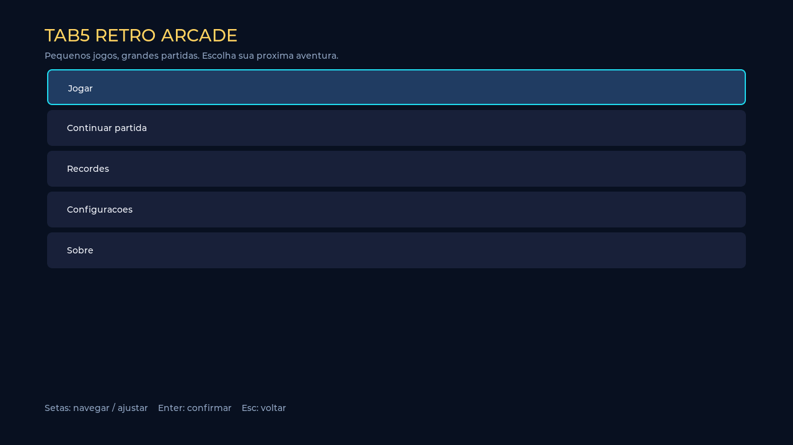

# Tab5 Retro Arcade — Pipoca5

**Pequenos jogos, grandes partidas.** Coleção offline de jogos 2D para o
M5Stack Tab5 e o teclado oficial A164. A pasta permanece `Pipoca5`; o firmware
usa **Tab5 Retro Arcade**, conforme [a especificação](docs/REQUISITOS.md).

C++17, ESP-IDF 5.4.4 e LVGL 9.5.0. A compilação real ESP32-P4 e os seis
executáveis de testes nativos passaram. **Boot, teclado, áudio, instalação pelo
Launcher e desempenho real ainda exigem validação no Tab5.** Nenhuma gravação
ou abertura de serial foi executada.



## Jogos

| Jogo | Mecânicas | Modalidades |
|---|---|---|
| Block Drop | Campo 10×20 + 4 linhas ocultas; sete peças; SRS/wall kicks; 7-bag; hold; cinco próximas; ghost; soft/hard drop; lock delay 500 ms/15 resets; combos, back-to-back, T-Spins e níveis | Maratona, Sprint 40 linhas, Ultra 2 minutos, Zen |
| Snake | Células com interpolação; fila de curvas sem reversão; colisões; wrap; obstáculos/labirinto; seis alimentos configuráveis e efeitos temporários | Clássico, Sobrevivência, Desafio 2 minutos, Labirinto |
| Retro Racer | Três faixas; aceleração/freio/direção simultâneos; turbo; tráfego; ultrapassagens; colisões/integridade; cinco veículos distintos; dia/noite | Arcade, Contra o relógio (3 km/60 s), Trânsito intenso, Estrada sem fim |

Cada jogo tem quatro dificuldades, pausa, reinício confirmado, save completo
e TOP10 por modalidade/dificuldade. Labirinto seleciona seu mapa no Snake;
Zen mantém a velocidade inicial. Os menus oferecem Jogar, Continuar partida,
Recordes, Configurações e Sobre, com teclado e toque complementar.

Configurações: brilho, volumes separados, música, efeitos, mudo, três temas,
nome padrão, remapeamento, grade dos blocos e FPS medido pelo renderer.

## BIN para instalar

Use **[tab5_retro_arcade-ota.bin](newversion/tab5_retro_arcade-ota.bin)** pelo
Launcher/WebUI. É somente a aplicação ESP32-P4. Tamanhos, versão, offsets e
hashes estão em [manifest.json](newversion/manifest.json) e
[SHA256SUMS.txt](newversion/SHA256SUMS.txt).

O pacote separado `tab5_retro_arcade-usb-full.bin` inclui bootloader, tabela
própria e aplicação, com base 0x0. Não é intercambiável com o app OTA.
Veja [instalação e particionamento](docs/INSTALACAO.md).

**Persistência via OTA:** a tabela instalada continua valendo. O namespace
`pipoca5` é exclusivo, mas o espaço NVS é compartilhado. O layout standalone
reserva 128 KiB; NVS pequenos, como os 24 KiB do layout anterior, podem esgotar
ao acumular saves e muitas categorias. A interface relata falhas e preserva
a partida na memória. Não há erase ou formatação automática do NVS.

## Compilar sem instalar

Instale ESP-IDF 5.4.x e ferramentas ESP32-P4. As dependências estão fixadas
em `main/idf_component.yml` e `dependencies.lock`; a primeira obtenção delas
precisa de internet. O firmware funciona offline.

```bash
./tools/build_ota.sh
```

O script executa build e empacotamento, sem flash/monitor. Preserva um ambiente
ESP-IDF já ativo; neste Mac também reconhece `idf5.4_py3.9_env`, evitando o
Python global incompatível. Não requer Arduino ou M5Unified. Após adicionar
arquivos, execute `idf.py reconfigure build`.

Em outra máquina, ative o ambiente Python instalado pelo ESP-IDF e seu
`export.sh` antes de chamar o script. Ele fixa o alvo em `esp32p4`.

Flash 16 MB, PSRAM, DIO/80 MHz, stacks principal/LVGL 16 KiB, FreeRTOS 1 kHz,
refresh LVGL de 16 ms. A simulação usa passo 16.667 µs; são configurações de
temporização, não prova de 60 FPS.

## Controles e persistência

Setas navegam, Enter confirma, Esc volta/pausa, P pausa/continua, R pede
reinício e M alterna som. Block Drop: Cima/X gira, Z gira ao contrário,
Espaço derruba, C reserva. Racer: Cima acelera, Baixo freia, Espaço turbo.
[Lista de controles](controles.md).

Pausa faz autosave; seu menu permite salvar manualmente e voltar salvando.
Continuar restaura estado e RNG. Nomes de até 15 caracteres são digitados no
teclado. Recordes e saves podem ser excluídos com confirmação. Preferências
são persistidas ao ajustar; Flash não é gravada por frame.

Sem cartão, usa NVS. `Configurações → Backup no microSD` exporta gerações de
configuração, saves e recordes para `/pipoca5/backup.bin`, em FAT/SDMMC.
Não formata o cartão. O backup é complementar; não há importação no Tab5
nesta versão. Inspeção no computador:

Backups seguintes recebem sufixos numerados, preservando os anteriores.

```bash
python3 tools/read_backup.py backup.bin --extract ./extraidos
```

## Estrutura e testes

```text
main/
  core/              Aplicação e navegação
  display/           Hardware, canvas LVGL e desenho
  input/             Teclado Normal e estado simultâneo
  audio/             Síntese PCM assíncrona original
  game_manager/      Contrato, adaptador e registro
  storage/           NVS, journal CRC, TOP10 e backup SD
  ui/                Menus por teclado/toque
  games/
    block_drop/      Configuração, modelo, renderização
    snake/
    retro_racer/
components/          BSP/teclado M5Stack com avisos preservados
tests/               Regras e integração com LVGL real
tools/               Build, pacotes e leitura de backup
docs/                Pesquisa, arquitetura, testes, limitações
newversion/          BINs e manifesto
```

```bash
python3 tests/run_tests.py
```

Requer C++17, Python, CMake e bibliotecas obtidas pelo build IDF. Usa
AddressSanitizer/UndefinedBehaviorSanitizer; Core/UI/renderers e LVGL são
reais, apenas periféricos são emulados. As imagens em `docs/previews` são
capturas desse renderer no computador.

Documentação: [arquitetura](docs/ARQUITETURA.md),
[adicionar jogo](docs/ADICIONAR_JOGO.md), [testes](docs/TESTES.md),
[limitações/aceitação física](docs/LIMITACOES.md), [plano](docs/PLANO.md).

Código original sob [MIT](LICENSE); terceiros mantêm suas licenças.
Consulte [THIRD_PARTY](docs/THIRD_PARTY.md).
